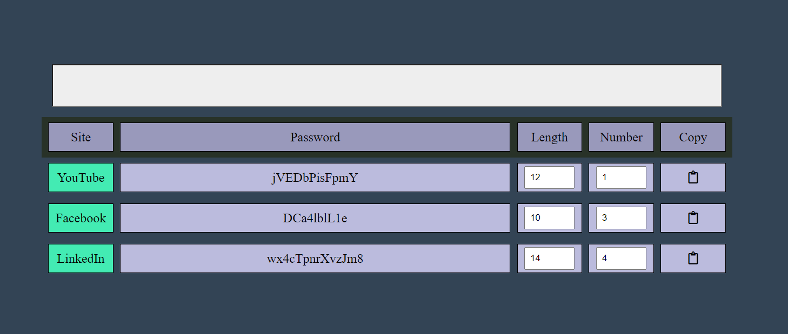
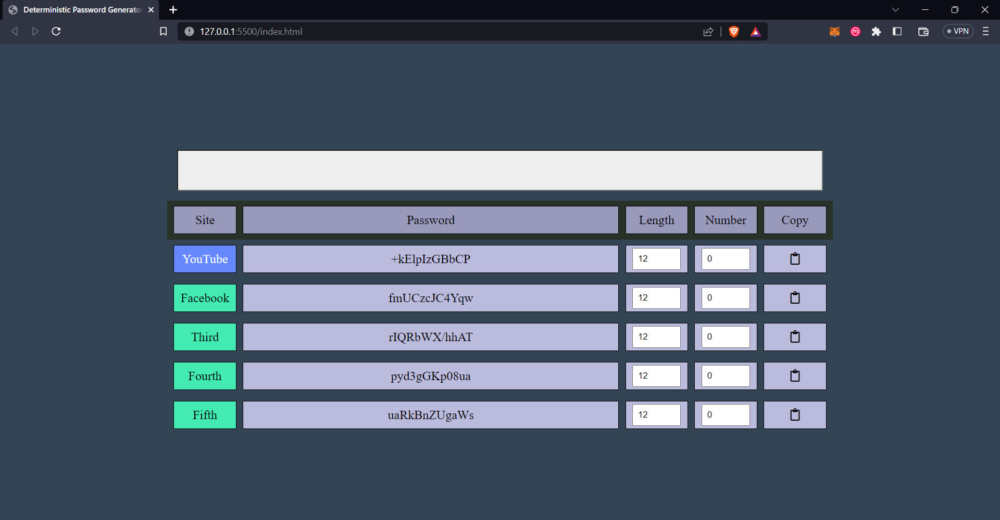
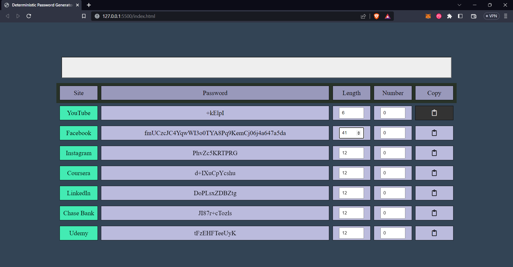
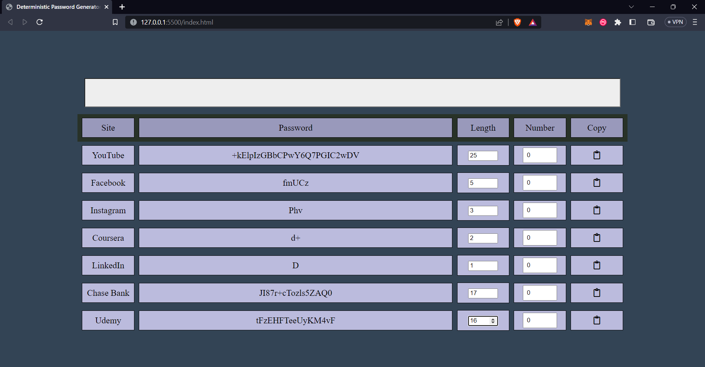
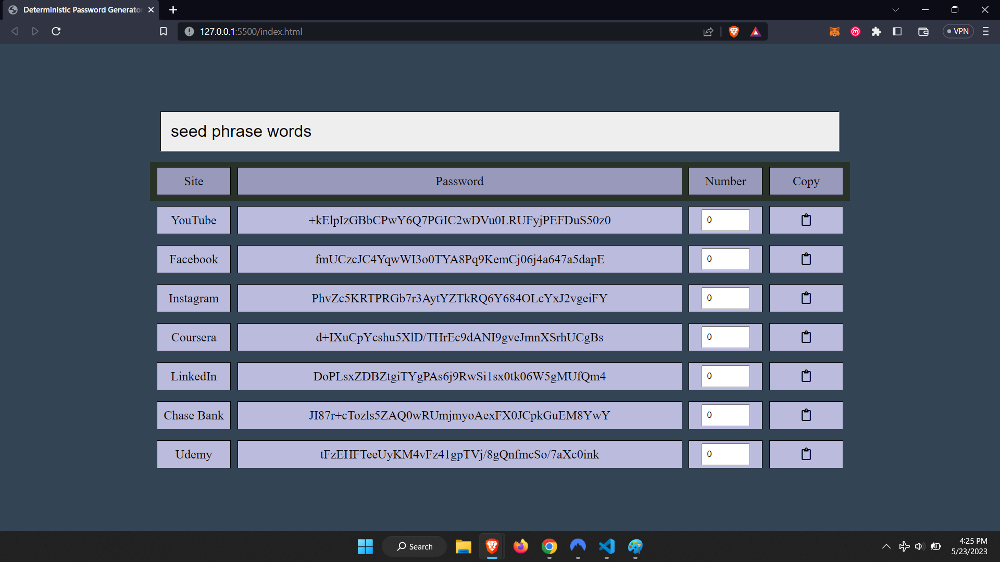
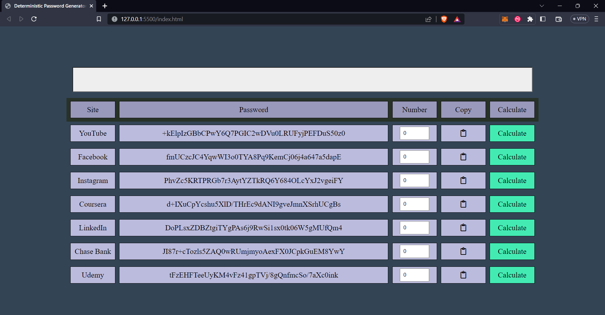

# Deterministic Password Vault

This project is an attempt to be a password vault that can generate deterministically pseudorandom password outputs to different applications a user may have, based off of no outside data or other exterior input.

Because it does this deterministically, no personal data needs to be stored anywhere, so there's no danger of passwords being "leaked" or stolen. All that is required is that
the user remembers their seed phrase, and that this seed phrase is obscure or random enough that it is implausible a would-be attacker could figure it out.

_This project is a **WIP**, updates and screenshots can be seen below._

## TODOS

1. ~~Remove "Calculate" button/column, as it calculates automatically~~
1. ~~Add "Length" column with + and - buttons (default value: 12)~~
1. Ability to save and load user configuration settings locally
1. Ability to add, edit, and delete rows

# Progress

## October 1, 2024

Adds rows dynamically based on data found in the file "data.txt" which is in the js/ folder and is in JSON format.

```
[
    {
        "site": "YouTube",
        "char_length": "12",
        "number": 1
    },
    {
        "site": "Facebook",
        "char_length": "10",
        "number": 3
    },
    {
        "site": "LinkedIn",
        "char_length": "14",
        "number": 4
    }
]
```



## May 24, 2023

It now adds rows dynamically based on a "data" list in the JS file.

`const data = ['YouTube', 'Facebook', 'Third', 'Fourth', 'Fifth'];`



## May 23, 2023

Made it prettier/fancier.



Added **Length** column to specify the desired character length of passwords. _By default, this value is set to **12**._



Removed **Calculate** button/column. It was redundant because the password is automatically calculated upon launching the application, and passwords are automatically recalculated anytime any value is changed (seed phrase, number, etc.).



## April 9, 2023

Completed first draft.


