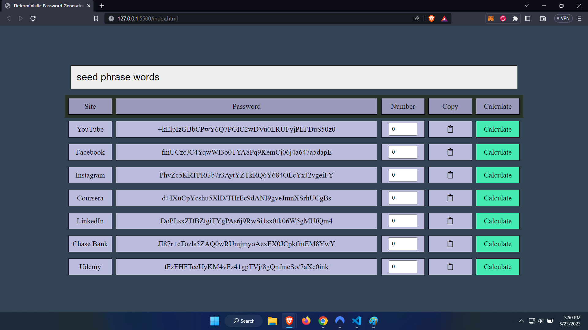

# Deterministic Password Vault

This project is an attempt to be a password vault that can generate deterministically pseudorandom password outputs to different applications a user may have, based off of no outside data or other exterior input.

Because it does this deterministically, no personal data needs to be stored anywhere, so there's no danger of passwords being "leaked" or stolen. All that is required is that
the user remembers there's seed phrase, and that this seed phrase is obscure or random enough that it is implausible a would-be attacker could figure it out.

_This project is a **WIP**, updates and screenshots can be seen below._

# Progress

## April 9, 2023

Completed first draft.

